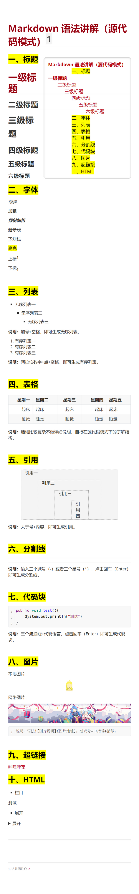

# 关于sigma9ForTypora #

## 这是啥 ##

这是由[SCP基金会](http://scp-wiki-cn.wikidot.com/)[^cn]设计的主题样式，我以[github.css](https://github.com/typora/typora-default-themes/blob/master/themes/github.css)为模板修改成适用于Typora的版本。

## 协议 ##

参照SCP基金会的格式，即为[CC-sa-by 3.0](LICENSE.md)

## 用法 ##

通常为把 `sigma9.css`文件拖入[这里](C:\Users\huangjm\AppData\Roaming\Typora\themes)[^？]。

## 求助 ##

我对css一知半解，如果有建议欢迎提出。

## 演示截图 ##

- 可以看出仍有许多bug以及未修改处。
- 由于导出图片产生的部分问题是未限制边框造成的

[^cn]:明确的来源是http://www.scp-wiki.net

[^？]:在网页上无法正常显示`C:\Users\huangjm\AppData\Roaming\Typora\themes`

